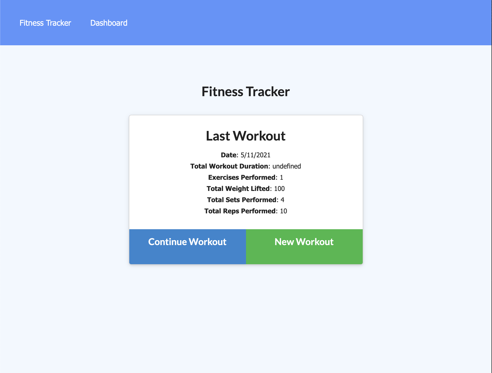
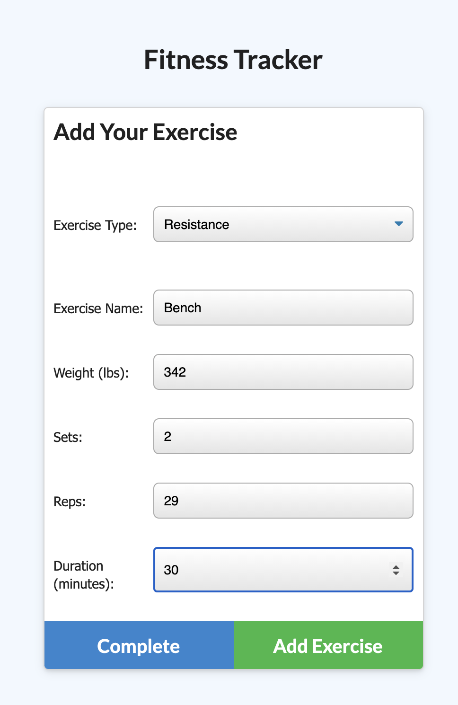
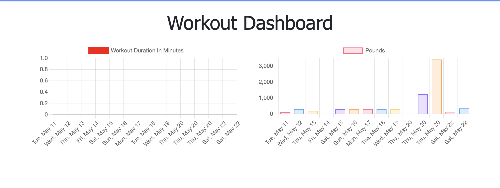

# workout-tracker
## Description
Workout Tracker provides an easy to input application to record recent workout activity of resistance and cardio training done by users. Users can log, track, and view previous workouts.

Deployed Version: [Workout-Tracker](https://workout-trackerbgm.herokuapp.com/)

## Install
Run a npm i in the root directory and have MongoDB installed and running.

## Questions
I can be reached at brandongmerritt@gmail.com with any questions related to iterating on this project.

## Github
My github can be found [Here](https://github.com/CrispyCoder817) and this project's repo can be found here [Here](https://github.com/CrispyCoder817/workout-tracker)

## Screenshots Local

